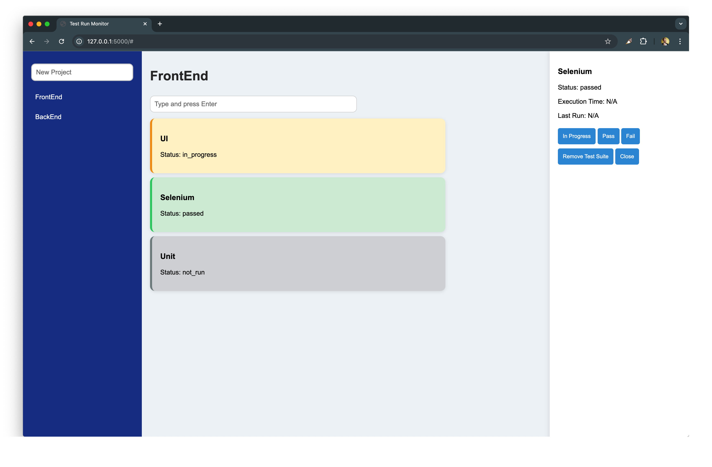

# Test Run Monitor

This is a web-based application for managing and monitoring test suites and projects. The application allows you to add, remove, and update projects and test suites, with status tracking and easy interaction through a UI.

## Features

- **Add/Remove/Update Projects**: Manage your test projects with ease.
- **Add/Remove/Update Test Suites**: Manage test suites within each project.
- **Track Test Suite Status**: View the status of each test suite (e.g., passed, failed, in-progress).
- **Responsive UI**: User-friendly interface with animations and hover effects.
- **APIs**: RESTful APIs for project and test suite management.

## Screenshots

### Dashboard


## Technologies Used

- **Backend**: Flask
- **Frontend**: HTML, CSS, JavaScript (Vanilla), Bootstrap
- **Database**: SQLite
- **Testing**: Selenium, Pytest
- **Containerization**: Docker, Docker Compose
- **CI/CD**: GitHub Actions

## Prerequisites

- **Python 3.7+**
- **Flask**
- **Docker & Docker Compose**

## Setup Instructions

1. **Clone the repository**:
   ```bash
   git clone https://github.com/MelnikovSergei/test-run-monitor.git
   cd test-run-monitor
   ```

2. **Setup the environment**:
   Create a Python virtual environment and install dependencies:
   ```bash
   python3 -m venv venv
   source venv/bin/activate
   pip install -r requirements.txt
   ```

3. **Run with Docker**:
   If you prefer running the application in Docker, you can use the Docker Compose setup:
   ```bash
   docker-compose up --build
   ```

   Access the application at `http://localhost:5000`.

4. **Running Tests**:
   - To run **UI tests** (Selenium):
     ```bash
     pytest tests/test_ui.py
     ```

   - To run **API tests** (Pytest):
     ```bash
     pytest tests/test_api.py
     ```

## Running Tests in CI/CD Pipeline

The project is configured with **GitHub Actions** to run the tests automatically on every push or pull request. The CI/CD pipeline is defined in the `.github/workflows/python-app.yml` file.

## API Endpoints

### Projects

- **GET /api/projects** - List all projects
- **POST /api/projects** - Create a new project
- **PATCH /api/projects/:id** - Update a project by ID
- **DELETE /api/projects/:id** - Delete a project by ID

### Test Suites

- **POST /api/projects/:project_id/test-suite** - Add a new test suite to a project
- **PATCH /api/test-suite/:id** - Update test suite status
- **DELETE /api/test-suite/:id** - Remove a test suite by ID

## License

This project is licensed under the MIT License. See the [LICENSE](LICENSE) file for details.

## Contact

For any inquiries, please contact the project owner at [melnikov.sergei.qa@gmail.com].
